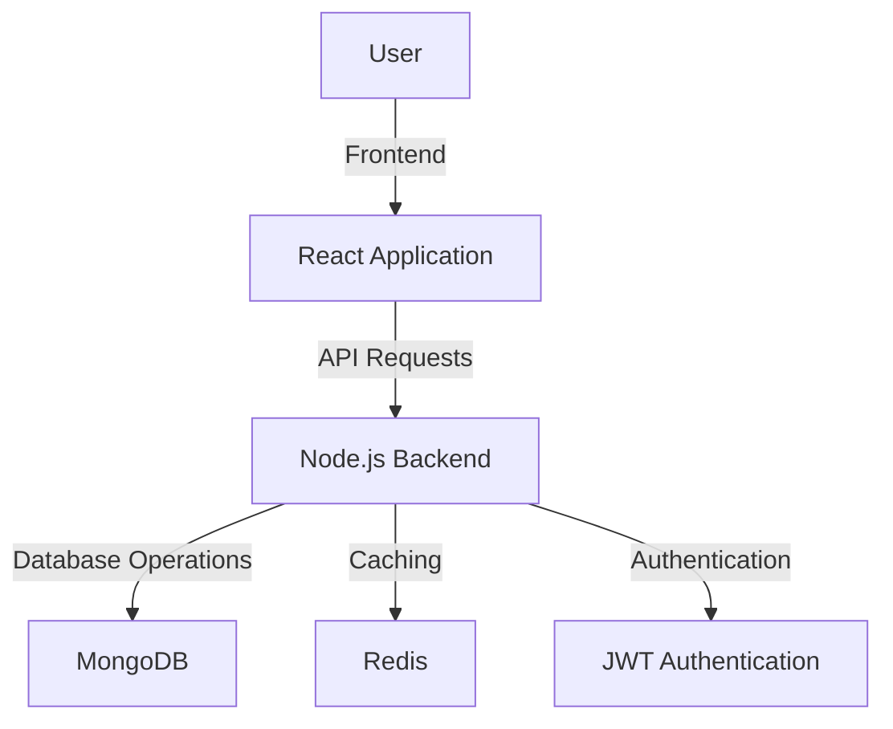

# API Sentinel

## Overview
API Sentinel is a full-stack application designed to monitor, analyze, and secure API usage. It provides robust backend services for logging, rate-limiting, and IP blocking, along with a modern frontend dashboard for visualization and management.

---

## Features

### Backend
- **Framework**: Built with Node.js and Express.
- **Database**: MongoDB for data storage, managed via Mongoose.
- **Caching**: Redis for caching and rate-limiting.
- **Security**:
  - JWT-based authentication.
  - Rate-limiting to prevent abuse.
  - IP blocking for enhanced security.
- **Logging**: Winston for structured logging.
- **Environment Variables**: Managed via `.env` for sensitive data.

### Frontend
- **Framework**: React with Vite for fast development and build.
- **Styling**: Tailwind CSS for responsive design.
- **Visualization**: Recharts for interactive data visualization.
- **API Integration**: Axios for seamless communication with the backend.
- **Animations**: Framer Motion for smooth transitions.

---

## Project Structure

### Backend
- **Controllers**: Handle business logic (e.g., `analyticsController.js`, `securityController.js`).
- **Middleware**: Security layers like `blockIP.js` and `rateLimiter.js`.
- **Models**: MongoDB schemas (e.g., `ApiLog.js`, `BlockedIP.js`).
- **Routes**: API endpoints (e.g., `analyticsRoutes.js`, `securityRoutes.js`).
- **Services**: Core functionalities like `detectionEngine.js`.

### Frontend
- **Source Files**: React components (`App.jsx`, `main.jsx`).
- **Assets**: Static files and styles (`App.css`, `index.css`).

---

## Environment Variables

### Backend
- `PORT`: Port for the backend server (default: 5000).
- `MONGODB_URI`: MongoDB connection string.
- `JWT_SECRET`: Secret key for signing and verifying JWTs.
- `REDIS_URL`: Redis connection string.

---

## Deployment Readiness
- **Backend**:
  - No syntax or dependency vulnerabilities (`npm audit` passed).
  - Sensitive data stored in `.env`.
  - Rate-limiting and IP blocking configured.
- **Frontend**:
  - Production build optimized using `vite build`.
  - No dependency vulnerabilities (`npm audit` passed).

---

## How This Project Helps

API Sentinel is designed to provide a secure and efficient way to monitor and manage API usage. Here's how it helps:

1. **Enhanced Security**:
   - Protects APIs from abuse with rate-limiting and IP blocking.
   - Ensures secure communication with JWT-based authentication.

2. **Analytics and Monitoring**:
   - Tracks API usage patterns to identify potential issues.
   - Provides insights into blocked IPs and rate-limited requests.

3. **User-Friendly Dashboard**:
   - Offers a modern, responsive frontend for visualizing analytics.
   - Allows administrators to manage security settings easily.

4. **Scalability**:
   - Built with scalable technologies like Redis and MongoDB.
   - Ready for deployment on cloud platforms.

---

## System Design

### High-Level Architecture


### Components
1. **Frontend**:
   - Built with React and styled using Tailwind CSS.
   - Communicates with the backend via Axios.

2. **Backend**:
   - Node.js with Express for handling API requests.
   - Middleware for rate-limiting and IP blocking.

3. **Database**:
   - MongoDB for storing API logs and blocked IPs.

4. **Caching**:
   - Redis for improving performance and managing rate limits.

---

## Next Steps
1. **Security Enhancements**:
   - Replace `JWT_SECRET` with a strong, randomly generated key.
   - Use HTTPS for all API calls.
2. **Deployment**:
   - Backend: Deploy using Docker and host on AWS, Google Cloud, or Azure.
   - Frontend: Deploy on Vercel, Netlify, or AWS S3 with CloudFront.
3. **Monitoring**:
   - Use tools like New Relic or Datadog for performance monitoring.

---

## How to Run

### Backend
1. Navigate to the backend directory:
   ```bash
   cd backend
   ```
2. Install dependencies:
   ```bash
   npm install
   ```
3. Start the server:
   ```bash
   node server.js
   ```

### Frontend
1. Navigate to the frontend directory:
   ```bash
   cd frontend
   ```
2. Install dependencies:
   ```bash
   npm install
   ```
3. Start the development server:
   ```bash
   npm run dev
   ```

---

## License
This project is licensed under the MIT License.
=======

